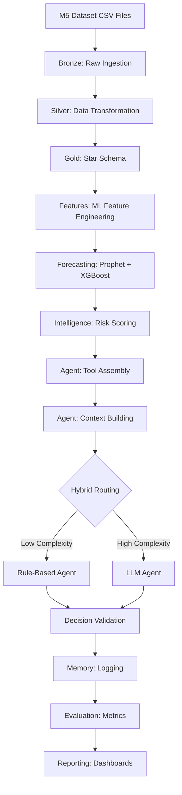

# End-to-End Workflow: Data to Decision Pipeline

This document provides a complete walkthrough of the AgentDB data-to-decision pipeline, from raw M5 dataset ingestion through agent invocation and evaluation.

## Pipeline Overview



---

## Stage 1: Data Ingestion (Bronze Layer)

**Purpose**: Load raw M5 Forecasting Competition dataset into Delta tables without transformation.

**Dataset**: M5 Forecasting Accuracy (Kaggle competition data)
- **sales_train_validation.csv**: 30,490 products × 1,913 daily sales columns (d_1 to d_1913)
- **sell_prices.csv**: 6.8M price records across products, stores, and weeks
- **calendar.csv**: 1,969 days with calendar features (holidays, events, SNAP eligibility)

**Tables Created**:
- `agentdb.bronze.sales_raw` — Unpivoted sales data (30K products × 1,913 days = 58M rows)
- `agentdb.bronze.sell_prices_raw` — Pricing history by product/store/week
- `agentdb.bronze.calendar_raw` — Date dimension with calendar features

**Notebooks**:
- `notebooks/bronze/01_ingest_sales.ipynb`
- `notebooks/bronze/02_ingest_prices.ipynb`
- `notebooks/bronze/03_ingest_calendar.ipynb`

**Key Operations**:
- CSV → Delta Lake ingestion
- Schema enforcement
- Data quality checks (NULL counts, range validation)

---

## Stage 2: Data Transformation (Silver Layer)

**Purpose**: Normalize raw data into clean entities with surrogate keys, implement SCD Type 2 for change tracking, and create agent operational logs.

**Transformations**:
- **Unpivot sales**: Convert 1,913 columns (d_1, d_2, ...) into date/quantity pairs
- **Surrogate key generation**: `product_key`, `store_key`, `supplier_key` (auto-increment integers)
- **SCD Type 2**: Track historical changes with `effective_from`, `effective_to`, `is_current` columns
- **Data quality**: Remove duplicates, handle NULLs, enforce referential integrity

**Tables Created** (15 total):
- **Entities**: `dim_products_silver`, `dim_stores_silver`, `dim_suppliers_silver`, `dim_dates_silver`, `dim_customers_silver`
- **Facts**: `fact_sales_silver`, `fact_inventory_silver`, `fact_purchase_orders_silver`
- **Logs**: `agent_run_log`, `agent_tool_execution_log`, `agent_action_log`
- **Mappings**: `product_supplier_mapping`, `product_category_mapping`

**Notebooks**:
- `notebooks/silver/01_transform_sales.ipynb`
- `notebooks/silver/02_transform_products.ipynb`
- `notebooks/silver/03_transform_stores.ipynb`
- `notebooks/silver/04_create_logs.ipynb`

**Key Operations**:
- Unpivot: `d_1, d_2, ..., d_1913` → `(date, quantity)` pairs
- Deduplication: Remove duplicate product/store/date combinations
- Surrogate key assignment: Hash-based deterministic key generation
- SCD Type 2: Version products/suppliers/stores on attribute changes

---

## Stage 3: Dimensional Modeling (Gold Layer)

**Purpose**: Build a star schema optimized for analytics and agent queries.

**Star Schema Design**:
- **5 Dimensions**: Products, Stores, Suppliers, Dates, Customers
- **8 Facts**: Sales, Inventory, Purchase Orders, Supplier Performance, Returns, Promotions, Prices, Forecast Accuracy

**Tables Created** (13 total):
- **Dimensions**: `dim_products`, `dim_stores`, `dim_suppliers`, `dim_dates`, `dim_customers`
- **Facts**: `fact_sales`, `fact_inventory`, `fact_purchase_orders`, `fact_supplier_performance`, `fact_returns`, `fact_promotions`, `fact_prices`, `fact_forecast_accuracy`

**Notebooks**:
- `notebooks/gold/01_create_dimensions.ipynb`
- `notebooks/gold/02_create_facts.ipynb`
- `notebooks/gold/03_validate_schema.ipynb`

**Key Operations**:
- Join silver entities to create conformed dimensions
- Aggregate sales by product/store/date
- Calculate derived metrics (revenue, profit, margins)
- Create date hierarchy (day → week → month → quarter → year)

**Example Fact Table** (`fact_sales`):
```sql
SELECT 
    s.product_key,
    s.store_key,
    s.date_key,
    s.quantity,
    s.quantity * p.sell_price AS revenue,
    s.quantity * (p.sell_price - prod.cost) AS profit
FROM agentdb.silver.fact_sales_silver s
JOIN agentdb.gold.dim_products prod ON s.product_key = prod.product_key
JOIN agentdb.bronze.sell_prices_raw p ON ...
```

---

## Stage 4: Feature Engineering (Features Layer)

**Purpose**: Pre-compute ML features for forecasting and risk scoring.

**Feature Categories**:
1. **Lag Features**: sales_lag_7d, sales_lag_14d, sales_lag_30d
2. **Rolling Aggregates**: rolling_avg_7d, rolling_avg_30d, rolling_std_7d
3. **Seasonality**: day_of_week, month, quarter, is_holiday, is_weekend
4. **Trends**: sales_trend_30d, momentum_7d
5. **Product Features**: category_avg_sales, category_volatility
6. **Store Features**: store_total_sales, store_product_count
7. **Calendar Features**: SNAP_CA, SNAP_TX, SNAP_WI, event_name, event_type

**Tables Created** (10 total):
- `features_lag` — Lag features (7d, 14d, 30d, 90d)
- `features_rolling` — Rolling windows (mean, std, min, max)
- `features_seasonality` — Calendar and holiday features
- `features_trend` — Linear and exponential trends
- `features_product` — Product-level aggregations
- `features_store` — Store-level aggregations
- `features_category` — Category-level aggregations
- `features_price` — Price elasticity and changes
- `features_inventory` — Stock levels and turnover
- `features_master` — All features joined (denormalized)

**Notebooks**:
- `notebooks/features/01_lag_features.ipynb`
- `notebooks/features/02_rolling_features.ipynb`
- `notebooks/features/03_seasonality_features.ipynb`
- `notebooks/features/04_trend_features.ipynb`
- `notebooks/features/05_master_features.ipynb`

**Key Operations**:
- Window functions: `LAG(...) OVER (PARTITION BY product_key, store_key ORDER BY date)`
- Rolling aggregations: `AVG(...) OVER (... ROWS BETWEEN 6 PRECEDING AND CURRENT ROW)`
- Seasonal decomposition: Isolate trend, seasonality, residual components

---

## Stage 5: Forecasting (Forecasting Layer)

**Purpose**: Generate demand forecasts using Prophet and XGBoost, register models in MLflow, and store predictions.

**Forecasting Models**:
1. **Prophet**: Time series model with trend, seasonality, holidays
2. **XGBoost**: Gradient boosting on engineered features
3. **Ensemble**: Weighted average of Prophet (60%) + XGBoost (40%)

**Forecast Horizons**:
- 7-day forecast (`forecast_7d`)
- 14-day forecast (`forecast_14d`)
- 30-day forecast (`forecast_30d`)

**Tables Created** (5 total):
- `demand_forecast` — Predictions by product/store/date/horizon
- `forecast_metrics` — MAE, MAPE, RMSE by model and horizon
- `forecast_model_registry` — MLflow model metadata (run_id, version, params)
- `forecast_confidence_intervals` — Upper/lower bounds (80%, 95%)
- `forecast_accuracy_tracking` — Actual vs predicted comparison

**Notebooks**:
- `notebooks/forecasting/01_train_prophet.ipynb`
- `notebooks/forecasting/02_train_xgboost.ipynb`
- `notebooks/forecasting/03_ensemble_forecast.ipynb`
- `notebooks/forecasting/04_register_models.ipynb`
- `notebooks/forecasting/05_evaluate_accuracy.ipynb`

**Key Operations**:
- Prophet training: Fit trend + yearly/weekly seasonality + holiday effects
- XGBoost training: Train on 50+ engineered features
- MLflow logging: Register models with versioning
- Prediction generation: Forecast next 30 days for all product/store combinations
- Accuracy calculation: Compare predictions to actuals, compute error metrics

**Example Prediction**:
```python
# Prophet forecast
model = mlflow.prophet.load_model("models:/demand_forecast_prophet/Production")
forecast = model.predict(future_df)

# XGBoost forecast
xgb_model = mlflow.xgboost.load_model("models:/demand_forecast_xgboost/Production")
xgb_forecast = xgb_model.predict(features_df)

# Ensemble
final_forecast = 0.6 * forecast['yhat'] + 0.4 * xgb_forecast
```

---

## Stage 6: Intelligence Layer (Intelligence Layer)

**Purpose**: Compute inventory risk, supplier risk, and generate recommendation registry.

**Risk Scoring Logic**:

**Inventory Risk** (`inventory_risk` table):
- **CRITICAL**: `projected_days_to_stockout < 7`
- **HIGH**: `projected_days_to_stockout < 14` OR `inventory_qty < safety_stock_qty`
- **MEDIUM**: `projected_days_to_stockout < 30`
- **LOW**: All other cases

**Supplier Risk** (`supplier_risk` table):
- **CRITICAL**: `on_time_delivery_rate < 70%` OR `quality_score < 3.0` OR `disruption_probability > 70%`
- **HIGH**: `on_time_delivery_rate < 85%` OR `quality_score < 4.0` OR `disruption_probability > 50%`
- **MEDIUM**: `on_time_delivery_rate < 95%`
- **LOW**: All other cases

**Tables Created** (3 total):
- `inventory_risk` — Risk levels by product/store with projected stockout dates
- `supplier_risk` — Supplier health scores and disruption probabilities
- `recommendation_registry` — Pre-generated recommendations (action, priority, urgency_score, reasoning)

**Notebooks**:
- `notebooks/intelligence/01_compute_inventory_risk.ipynb`
- `notebooks/intelligence/02_compute_supplier_risk.ipynb`
- `notebooks/intelligence/03_generate_recommendations.ipynb`

**Key Operations**:
- Inventory risk: `projected_days_to_stockout = inventory_qty / forecast_7d * 7`
- Supplier risk: Aggregate late deliveries, quality issues, lead time variance
- Recommendation generation: Apply business rules to risk levels

**Example Risk Calculation**:
```sql
SELECT 
    product_key,
    store_key,
    inventory_qty,
    forecast_7d,
    safety_stock_qty,
    CASE 
        WHEN inventory_qty / (forecast_7d / 7.0) < 7 THEN 'CRITICAL'
        WHEN inventory_qty / (forecast_7d / 7.0) < 14 THEN 'HIGH'
        WHEN inventory_qty < safety_stock_qty THEN 'HIGH'
        WHEN inventory_qty / (forecast_7d / 7.0) < 30 THEN 'MEDIUM'
        ELSE 'LOW'
    END AS risk_level,
    inventory_qty / (forecast_7d / 7.0) AS projected_days_to_stockout
FROM inventory_snapshot
JOIN demand_forecast USING (product_key, store_key)
```

---

## Stage 7: Agent Invocation (Agentic Decision Layer)

**Purpose**: Execute the agent decision workflow — tool calls, context assembly, agent routing, validation, and logging.

**Workflow Steps**:

1. **Tool Execution** (5 tools run in parallel):
   - `get_inventory_risk(product_key, store_key)`
   - `get_supplier_risk(supplier_key)`
   - `get_forecast(product_key, store_key, horizon='7d')`
   - `get_recommendation(product_key, store_key)`
   - `get_purchase_orders(product_key, store_key)`

2. **Context Assembly**:
   - Merge tool outputs into a single `context` dictionary
   - Extract key facts (risk levels, forecast values, PO counts)

3. **Complexity Scoring** (Hybrid Agent only):
   - Calculate score based on 7 factors:
     - Imminent stockout (<7 days): +3.0
     - Stockout within 14 days: +1.5
     - CRITICAL inventory risk: +2.0
     - HIGH inventory risk: +1.0
     - CRITICAL supplier risk: +2.0
     - HIGH supplier risk: +1.0
     - Repeated recommendations: +2.0
   - Route: score < 3.0 → Rule Engine, score ≥ 3.0 → LLM Engine

4. **Agent Decision**:
   - **Rule Engine**: Apply if-then rules to risk levels
   - **LLM Engine**: Call Llama 3.3 70B with context, get structured JSON decision
   - **Fallback**: If LLM fails, fall back to rule engine (marked as `rule_fallback`)

5. **Output Validation**:
   - Check required fields: `action`, `priority`, `confidence`, `reasoning`
   - Validate enums: `action` in {EXPEDITE_PO, REORDER, SUPPLIER_ALERT, NO_ACTION}
   - Validate ranges: `confidence` in [0, 1], `urgency_score` in [0, 100]

6. **Memory Logging**:
   - `agent_run_log`: Start/end timestamps, execution duration, recommendations generated
   - `agent_tool_execution_log`: Tool name, duration, success/failure
   - `agent_action_log`: Recommended action, status (PENDING/ACCEPTED/REJECTED)

**Files**:
- `src/agents/orchestrator/run_supply_chain_agent_v2.py` — Main entry point
- `src/agents/orchestrator/context_builder.py` — Context assembly logic
- `src/agents/orchestrator/tool_registry.py` — Tool registration and execution
- `src/agents/orchestrator/output_validator.py` — Decision validation

**Example Invocation**:
```python
from agents.orchestrator.run_supply_chain_agent_v2 import run_agent

result = run_agent(
    agent_type="hybrid",  # or "rule" or "llama"
    product_key=1001,
    store_key=1,
    supplier_key=101,
    complexity_threshold=3.0
)

# Result structure:
# {
#     "action": "EXPEDITE_PO",
#     "priority": "CRITICAL",
#     "confidence": 0.95,
#     "reasoning": "Projected stockout in 3 days with CRITICAL inventory risk.",
#     "complexity_score": 5.0,
#     "decision_engine": "llama",
#     "engine_status": "SUCCESS"
# }
```

---

## Stage 8: Evaluation (Evaluation Layer)

**Purpose**: Compare agent decisions, track business metrics, and generate decision explanations for audit trails.

**Evaluation Components**:

1. **Agent Comparison**:
   - Run Rule, LLM, and Hybrid agents on the same context
   - Compare actions, priorities, and reasoning
   - Calculate agreement rate (e.g., "Rule and LLM agree on action 85% of the time")

2. **Business Metrics**:
   - **Stockouts Prevented**: Count of EXPEDITE_PO actions that prevented stockouts
   - **Fill Rate**: % of orders fulfilled without stockout
   - **Service Level**: % of product/store combinations with LOW risk
   - **Carrying Cost Tradeoff**: Inventory holding cost vs stockout cost

3. **Decision Explanation**:
   - Capture full provenance for every decision:
     - Tools used, facts extracted from each tool
     - Decision engine (rule/llama/rule_fallback)
     - Engine status (SUCCESS/FAILED)
     - Fallback reason (if applicable)
     - Agent version, timestamp

**Tables Created** (5 total):
- `eval_agent_performance` — Success rate, latency, tool usage per agent type
- `eval_agent_comparison` — Side-by-side comparison (Rule vs LLM vs Hybrid)
- `eval_decision_explanations` — Full provenance for each decision
- `eval_business_metrics` — Stockouts, fill rate, service level, costs
- `eval_forecast_accuracy` — Forecast error metrics by model/horizon

**Files**:
- `src/agents/evaluation/comparison_framework.py` — Agent comparison logic
- `src/agents/evaluation/metrics_tracker.py` — Business metrics calculation
- `src/agents/evaluation/decision_explanation.py` — Explanation generation
- `src/agents/evaluation/business_metrics.py` — ROI and cost tracking

**Example Comparison**:
```python
from agents.evaluation.comparison_framework import compare_agents

comparison = compare_agents(
    product_key=1001,
    store_key=1,
    supplier_key=101
)

# Output:
# {
#     "rule": {"action": "REORDER", "priority": "HIGH", "confidence": 1.0},
#     "llama": {"action": "REORDER", "priority": "HIGH", "confidence": 0.92},
#     "hybrid": {"action": "REORDER", "priority": "HIGH", "confidence": 0.92,
#                "decision_engine": "rule", "complexity_score": 1.5},
#     "agreement": {"action": True, "priority": True},
#     "recommended": "hybrid"
# }
```

**Example Business Metrics**:
```python
from agents.evaluation.business_metrics import calculate_business_impact

metrics = calculate_business_impact(
    start_date="2024-01-01",
    end_date="2024-01-31"
)

# Output:
# {
#     "stockouts_prevented": 47,
#     "fill_rate": 0.9823,
#     "service_level": 0.9156,
#     "avg_inventory_days": 45.2,
#     "carrying_cost_savings": 125000,
#     "stockout_cost_avoided": 235000,
#     "total_value": 360000
# }
```

---

## Stage 9: Reporting (Reporting Layer)

**Purpose**: Provide executive dashboards and operational monitoring views.

**Reporting Views** (10 total):
- `rpt_inventory_status` — Current inventory levels, risk, days to stockout
- `rpt_supplier_health` — Supplier performance, risk, disruption probability
- `rpt_agent_performance` — Agent success rate, latency, recommendations generated
- `rpt_forecast_accuracy` — MAE, MAPE by model and horizon
- `rpt_recommendation_summary` — Action counts, urgency distribution
- `rpt_stockout_risk` — Products at CRITICAL/HIGH risk
- `rpt_business_metrics` — Fill rate, service level, costs
- `rpt_agent_comparison` — Rule vs LLM agreement rates
- `rpt_decision_audit` — Full decision log with explanations
- `rpt_daily_summary` — Key metrics aggregated by day

**Notebooks**:
- `notebooks/reporting/01_create_views.ipynb`
- `notebooks/reporting/02_schedule_refreshes.ipynb`

**Example Dashboard Query**:
```sql
SELECT 
    COUNT(*) AS total_products,
    SUM(CASE WHEN risk_level = 'CRITICAL' THEN 1 ELSE 0 END) AS critical_risk,
    SUM(CASE WHEN risk_level = 'HIGH' THEN 1 ELSE 0 END) AS high_risk,
    AVG(projected_days_to_stockout) AS avg_days_to_stockout,
    SUM(CASE WHEN recommendation_type = 'EXPEDITE_PO' THEN 1 ELSE 0 END) AS expedite_po_count
FROM agentdb.reporting.rpt_inventory_status
WHERE date = CURRENT_DATE()
```

---

## Key Takeaways

1. **Layered Design**: Each stage builds on the previous, with clear separation of concerns
2. **Delta Lake**: All tables use Delta format for ACID transactions and time travel
3. **Scalability**: Spark processes 58M sales records, 3,792 inventory snapshots, 948 products
4. **Observability**: Full logging at every stage (bronze → silver → gold → agent)
5. **Explainability**: Decision explanations capture "why" for every recommendation
6. **Extensibility**: Easy to add new tools, agents, features, or risk factors

**Total Tables**: 50+ across 8 schema zones  
**Total Notebooks**: 30+ covering all pipeline stages  
**Total Code Files**: 50+ in `src/agents/`  
**Processing Time**: ~45 minutes for full pipeline (bronze to reporting)
